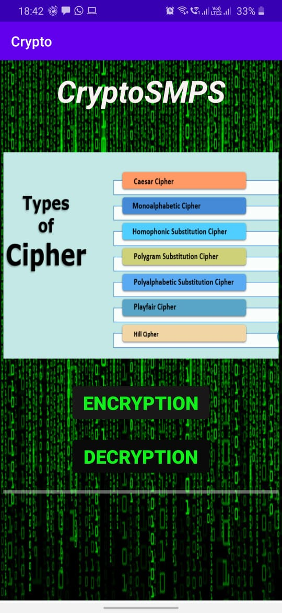
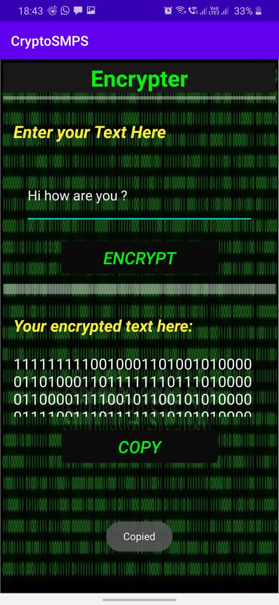
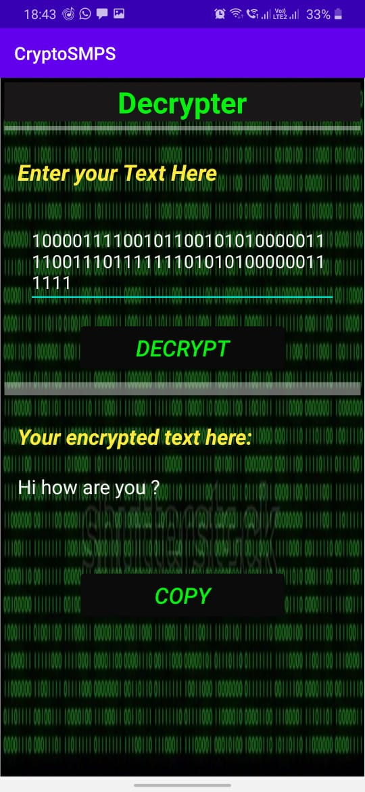

# CryptoSMPS-AndroidApp
Main Page

 

Encryption page and here you can copy the binary code(Encrypted page).

 

Decryption page and you can see the Original message:

<br 
  
## MIT License

Copyright (c) 2020 SrujanCheemakurthi
   
## MIT License

Copyright (c) 2020 SrujanCheemakurthi
A permissive license whose main conditions require preservation of copyright and license notices. Contributors provide an express grant of patent rights. Licensed works, modifications, and larger works may be distributed under different terms and without source code.
